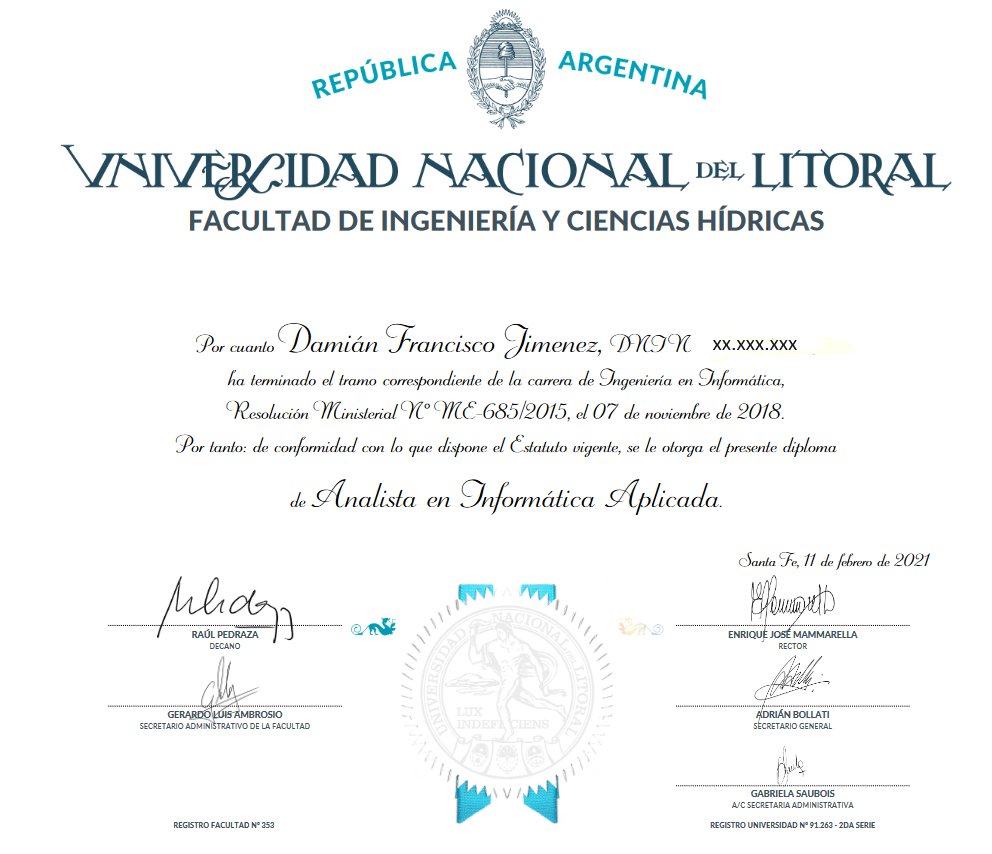
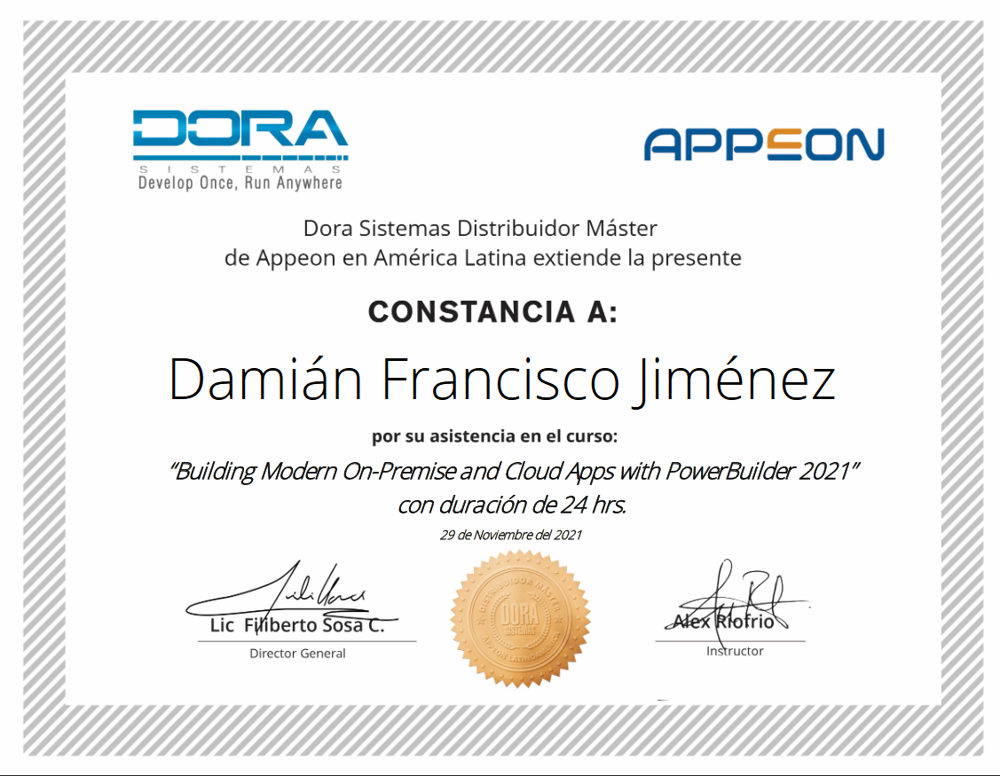
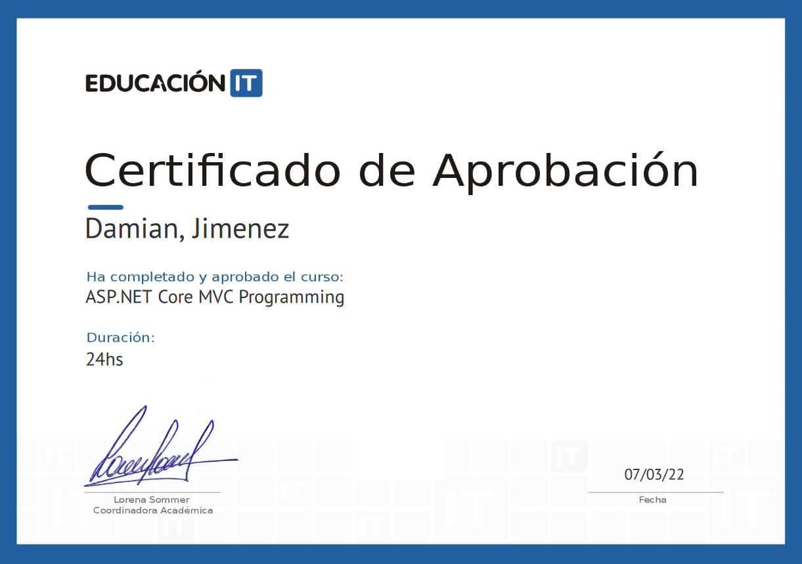
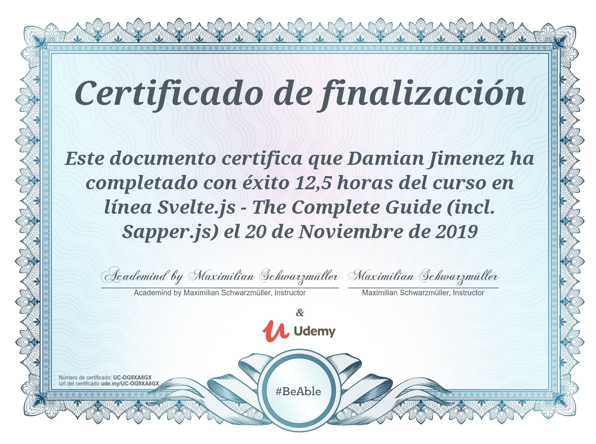
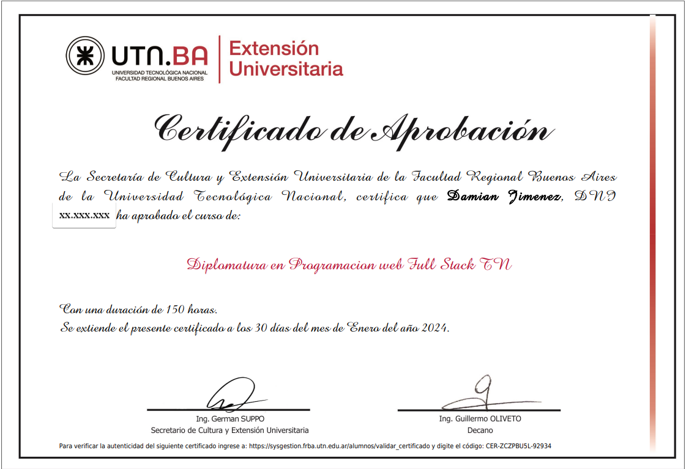

## Damián Jimenez
#### Paraná - Entre Rios - Argentina
Linkedin: https://www.linkedin.com/in/damianjimenezarg/  
Certificados: https://github.com/damianinsof/damianinsof/tree/main/Files
Email: Sabypna@gmail.com

 #### Introduction
 I finished my degree which I had abandoned when I turned 50. I really enjoy my current occupation which consists of developing new products, migrations and fixes of existing software.

 #### Presentación
Termine mi carrera que habia abandonado cuando cumplí mis 50 años. Realmente disfruto de mi ocupacion actual. Que consiste en desarrollo de nuevos productos, migraciones y arreglos de software existente.

#### Skills - Habilidades

* Powerbuilder v2017 to v2022  (Powerbuilder/Powerserver)
* C# .NETcore MVC  Html CSS JS React
*  SQL Server

### History Work - Experiencias 

|Job| Name Business | Years |
|:---:|:---:|:----:|
|software developer  | Self Developer |11/22 - today Integral Software (07/24) Be The Driver |
|software developer  | Integral Software |2020- October 2022 |

#### Educación

#### Analista en Informática Aplicada - Universidad Nacional Litoral - Santa Fe.

##### Técnico en Computación - ENET Nº 1 - Paraná -Entre Rios

# Latest Certificates

 

